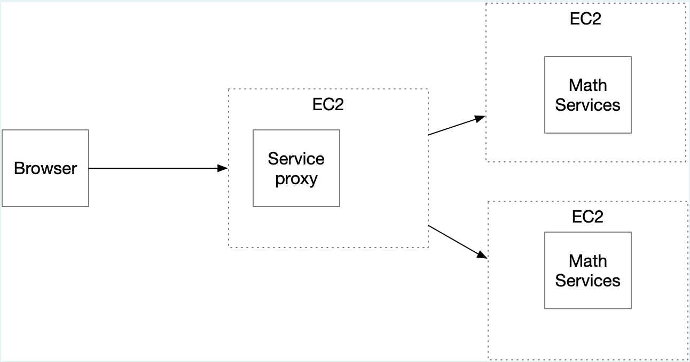
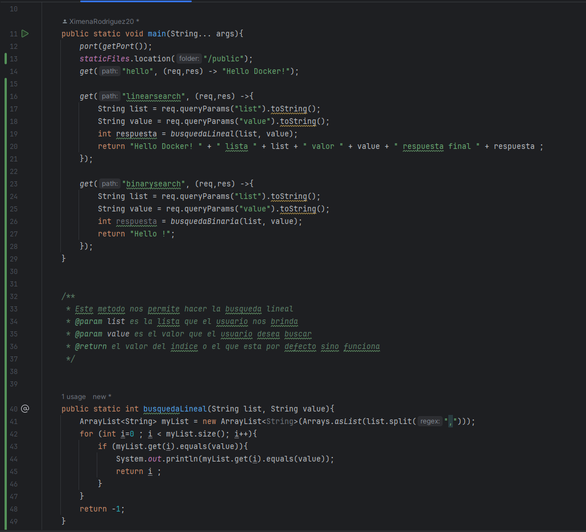
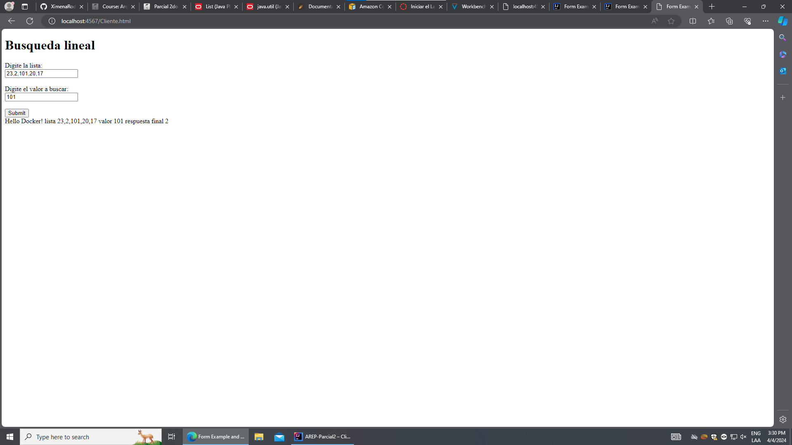

# AREP-Parcial2

## Arquitectura

## Diseño

SparkWebServer

Esta clase contiene los endopints donde se reciben los datos que el usuario digita, ademas cuenta con unas funciones que se encargan de hacer las operaciones de Busquedas(estas estan documentadas en el codigo)

HttpConnectionExample es la clase que va a permitirnos conectar desde el cliente con el Proxy para lograr el acceso a los servicios que de MS

## Pruebas

Busqueda lineal

Implementando el cliente 

## Despliegue en AWS

## Autor

**Ximena Rodriguez**