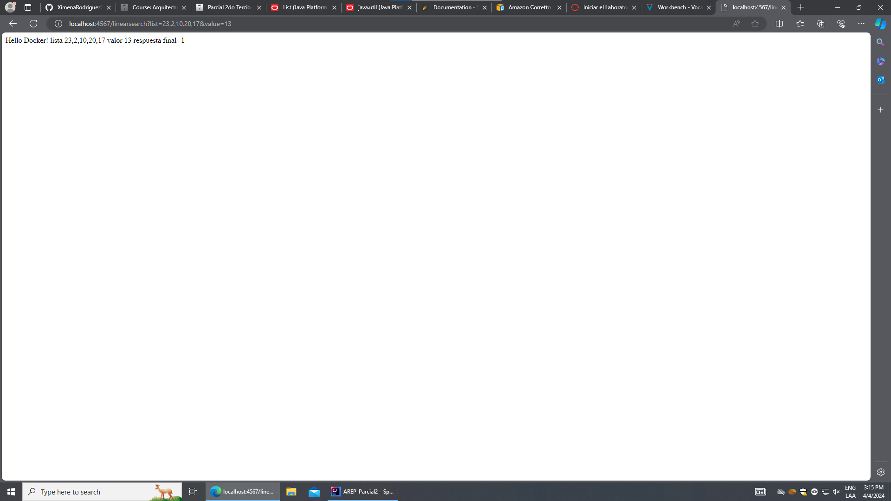

# AREP-Parcial2

## Arquitectura

La arquitectura que se va a manejar es la siguiente:

### Proxy

Es la clase que se encarga de conectar al cliente con los servicios MathServices, además contiene un metodo  de balanceador de cargas(Round-Robin).

### MathServices

Es la clase que se encarga de realizar las respectivas operaciones de busqueda. 

## Diseño

### MathServices

Esta clase contiene los endopints donde se realizan las respectivas busquedas(estas estan documentadas en el codigo), dentro de estos endpoints hay funciones que se encargan de hacer las operaciones(logica). Por otro lado, la clase MathServices recibe los datos a traves de la clase HttpConnectionExample.

Estado inicial:

Estado final:

### HttpConnectionExample 

Es la clase que va a permitir conectar el Proxy con el MathServices por medio de peticiones HTTP.

### Proxy 

Esta clase contiene los endpoints para cada respectiva busqueda(lineal y binaria), además hace uso de la clase HttpConnectionExample para conectar a traves de peticiones Http con el servicio MathServices, por ultimo delega a las dos instancias del servicio de ordenamiento usando un algoritmo de round-robin.

## Empezando

* Para obtener una copia del proyecto en su maquina local:

    - Se debe ubicar en la carpeta donde desea bajar el proyecto y le da click donde señala la flecha y esribe cmd:

      

    - Después de esto debe escribir el siguiente comando:

        ~~~                  
        git clone https://github.com/XimenaRodriguez20/AREP-Parcial2.git
        ~~~                                                                   

* Para poder correr el código abra el IDE de su preferencia y anote los siguientes comandos en la terminal:

    - Para compilar el proyecto utilice:

        ~~~                 
            mvn clean install
        ~~~  

* En este caso debemos iniciar ambos servicios ya sea por comando o con ayuda del IDE por comando debera ingresar estos comandos:

    - Para correr el servicio Proxy:

        ~~~
            java -cp "target/classes;target/dependency/*" org.example.Proxy
        ~~~

    - Para correr el servicio MathServices:

        ~~~
            java -cp "target/classes;target/dependency/*" org.example.MathServices
        ~~~

* Si desea correr desde el cmd haga los pasos mencionados anteriormente, pero antes de eso recuerde ubicarse en la carpeta del proyecto:

    ~~~
        cd AREP-Parcial2/
    ~~~

* Para correr con ayude del IDE ingrese a la clase de Proxy, MathServices y ponga a correr cada clase como se muestra a continuación:

    Se puede dar click derecho y se pone a correr o se le da click en la flechita verde que se señala en las siguientes imagenes:
  
    

    Como podemos evidenciar cuando corremos MathServices se puede evidenciar que ya esta corriendo el otro servicio:
  
    

## Pruebas

Para realizar estas pruebas debemos ingresar a la siguiente url:

~~~
    http://localhost:4569/Cliente.html
~~~

### Implementando el cliente 

Estas pruebas son cuando el valor a buscar se encuentra dentro del array.
    
* Inicial 

* Final 

Cuando no se encuentra el valor dentro del array nos retorna el respectivo valor de -1.

Ademas para aclarar en el caso de la busqueda binaria si la lista no se encuentra en orden, deja en pantalla el valor de la ultima consulta pero en el IDE aparece un mensaje, esto se realizo con la ayuda de un try, catch para evitar que saliera un error 500 de un fallo en el servidor.

### Busqueda lineal 

* Inicial

* Final
  

### Busqueda binaria 

## Despliegue en AWS

* [Despliegue](https://youtu.be/GEWri45_XdA)

## Autor

* **Ximena Rodriguez** 
